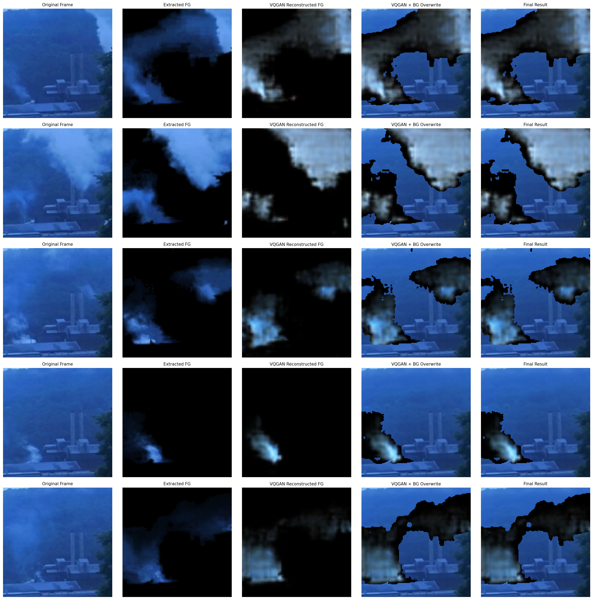

# Modélisation des panaches de fumées industrielles — Flow Matching

Ce dépôt contient le code et les ressources pour la modélisation des panaches de fumées industrielles, basé sur des approches VQGAN et Flow Matching pour la génération vidéo.

## Quelques exemples de travaux

### Reconstruction VQGAN
Comparaison entre les images originales et leurs reconstructions par le VQGAN :

<p align="center">
  
</p>

### Génération de séquences vidéo
Résultats de génération de séquences de fumée avec le modèle Flow Matching :

<p align="center">
  
</p>

### Comparaison vidéos réelles vs générées

<table align="center">
  <tr>
    <td align="center">
      <b>Vidéos Réelles</b><br>
      
    </td>
    <td align="center">
      <b>Vidéos Générées</b><br>
      
    </td>
  </tr>
</table>

*Ces GIFs sont automatiquement générés par WandB pendant l'entraînement Flow Matching (step 109999 = checkpoint final). Le modèle génère 9 frames à partir d'1 frame de contexte.*

---

## Table des matières

1. [Prérequis](#prérequis)
2. [Installation](#installation-de-lenvironnement)
3. [Dataset : Préparation](#dataset--préparation-complète)
4. [Architecture](#architecture-et-structure-du-projet)
5. [Entraînement VQGAN](#étape-1--entraînement-vqgan)
6. [Entraînement Flow Matching](#étape-2--entraînement-flow-matching)
7. [Scripts utiles](#scripts-utiles)
8. [Dépannage](#dépannage)
9. [Crédits](#crédits-et-citations)

---

## Prérequis

### Matériel
- **GPU NVIDIA** avec au moins 8 GB de VRAM (recommandé : 16 GB+)
- **RAM** : 32 GB recommandés
- **Espace disque** : ~50 GB pour le dataset + ~20 GB pour les checkpoints

### Logiciels
- Conda ou Mamba
- Pilotes NVIDIA (vérifier avec `nvidia-smi`)
- Python 3.9+
- CUDA 11.8+ (compatible avec PyTorch 2.0+)

---

## Installation de l'environnement

### 1. Cloner le dépôt
```bash
git clone https://github.com/omdrift/Modelisation-panaches-de-fum-es-industrielles-par-Flow-Matching.git
cd Modelisation-panaches-de-fum-es-industrielles-par-Flow-Matching
```

### 2. Créer l'environnement Conda
```bash
conda env create -f environment.yml -n river
conda activate river
```

### 3. Vérifier l'installation
```bash
# Vérifier CUDA
nvidia-smi

# Vérifier PyTorch et CUDA
python -c "import torch; print(f'PyTorch: {torch.__version__}'); print(f'CUDA available: {torch.cuda.is_available()}')"

# Vérifier les packages principaux
python -c "import torchvision, wandb; print('✓ Tous les packages sont installés correctement')"
```

### 4. Configuration Weights & Biases (WandB)

WandB est **fortement recommandé** pour suivre vos entraînements en temps réel.

#### Installation et authentification

```bash
# Installer wandb (déjà inclus dans environment.yml)
pip install wandb

# Se connecter à votre compte WandB
wandb login

# Ou utiliser une clé API
wandb login --relogin
# Puis coller votre clé API depuis https://wandb.ai/authorize
```

#### Configuration du projet

```bash
# Initialiser WandB pour le projet (optionnel)
wandb init --project smoke-flow-matching --entity your-username
```

#### Utilisation dans les scripts

Tous les scripts d'entraînement supportent `--wandb` :

```bash
# VQGAN avec WandB
python train_vqgan.py --config configs/config_vqgan.yaml --wandb

# Flow Matching avec WandB  
python train.py --config configs/smoke_dataset_vqgan.yaml --wandb
```

#### Ce que WandB track automatiquement

**Pour VQGAN** :
- Pertes (reconstruction, perceptual, adversarial, codebook)
- Métriques (PSNR, SSIM, codebook usage)
- Images de reconstruction (originales vs reconstructions)
- Hyperparamètres et configuration
- Utilisation GPU et mémoire

**Pour Flow Matching** :
- Flow Matching Loss (décroissance)
- Vidéos générées vs vidéos réelles (GIFs comparatifs)
- Métriques vidéo (FVD, SSIM temporel)
- Graphiques de l'ODE solver
- Learning rate schedule
- Gradient norms

#### Accéder à vos runs

```bash
# URL du dashboard
https://wandb.ai/your-username/smoke-flow-matching

# Récupérer les fichiers d'un run
wandb restore run_id
```

---

## Dataset : Préparation complète

### Vue d'ensemble
Le jeu de données est un instantané de l'outil d'annotation de fumée du 24 février 2020. Il contient **12 567 clips vidéo** provenant de trois sites industriels de surveillance.

### Labels ciblés
Nous priorisons les annotations indiquant des émissions de fumée confirmées :
- **`47` (Positive)** : validation par un·e chercheur·se
- **`23` (Strong Positive)** : accord de deux volontaires ou confirmation chercheur·se

### Résolutions disponibles
- **Standard** : 180×180 px
- **Haute résolution** : 320×320 px (remplacer `/180/` par `/320/` dans l'URL)

### Pipeline de préparation (4 étapes)

#### **Étape 1 : Téléchargement des vidéos** (`dataset_init.py`)

Télécharge les vidéos depuis les URLs du fichier `metadata_02242020.json`.

```bash
python dataset_init.py
```

**Options** (modifiables dans le script) :
- `RESOLUTION` : `"180"` ou `"320"`
- `OUTPUT_DIR` : dossier de destination (défaut : `smoke_videos/`)
- `MAX_WORKERS` : threads pour téléchargement parallèle (défaut : 10)
- `LABELS` : labels à télécharger (défaut : `[23, 47]`)

**Sortie** : `smoke_videos/` avec structure par vue (`view_0-10/`, `view_1-4/`, etc.)

#### **Étape 2 : Extraction et matting** (`prepare_dataset.py`)

Extrait les frames et applique un algorithme de matting pour isoler la fumée.

```bash
python prepare_dataset.py
```

**Processus** :
1. Charge chaque vidéo MP4
2. Extrait les frames individuelles
3. Applique RVM (Robust Video Matting) pour isoler la fumée
4. Sauvegarde en PNG

**Paramètres** (dans le script) :
- `INPUT_DIR` : `smoke_videos/`
- `OUTPUT_DIR` : `isolated_smoke_frames/`
- `BACKGROUND_MODEL` : `rvm_resnet50.pth`

**Sortie** : `isolated_smoke_frames/` (structure miroir de `smoke_videos/`)

#### **Étape 3 : Organisation et splits** (`organize_dataset.py`)

Organise les frames en séquences et crée les splits train/val/test.

```bash
python organize_dataset.py
```

**Fonctionnalités** :
- Regroupe frames par séquence vidéo
- Renommage standardisé : `video_XXXX_frame_YYYY.png`
- Création automatique des splits : **80% train / 10% val / 10% test**
- Génère les listes : `train_files.txt`, `val_files.txt`, `test_files.txt`
- Calcule les statistiques : `dataset_stats.json`

**Sortie** :
```
final_dataset/
├── train/                # Frames d'entraînement
├── val/                  # Frames de validation  
├── test/                 # Frames de test
├── train_files.txt       # Liste des séquences train
├── val_files.txt         # Liste des séquences val
├── test_files.txt        # Liste des séquences test
└── dataset_stats.json    # Statistiques complètes
```

#### **Étape 4 : Vérification d'intégrité** (`split_labels.py`)

Vérifie que toutes les séquences sont complètes (pas de frames manquantes).

```bash
python split_labels.py
```

**Sortie** : `missing_frames_report.json` (si frames manquantes détectées)

### Workflow complet recommandé

```bash
# 1. Télécharger les vidéos (peut prendre plusieurs heures)
python dataset_init.py

# 2. Extraire et isoler les frames (traitement intensif)
python prepare_dataset.py

# 3. Organiser le dataset et créer les splits
python organize_dataset.py

# 4. Vérifier l'intégrité
python split_labels.py

# 5. Vérifier la structure finale
ls -lh final_dataset/
cat final_dataset/dataset_stats.json
```

**Durée estimée** : 4-8 heures (selon connexion internet et CPU/GPU)

---

## Crédits et citations

### Project RISE
Si vous utilisez ce jeu de données ou le code, merci de citer :

```bibtex
@inproceedings{hsu2021project,
  title={Project RISE: Recognizing Industrial Smoke Emissions},
  author={Hsu, Yen-Chia and Huang, Ting-Hao (Kenneth) and Hu, Ting-Yao and Dille, Paul and Prendi, Sean and Hoffman, Ryan and Tsuhlares, Anastasia and Pachuta, Jessica and Sargent, Randy and Nourbakhsh, Illah},
  booktitle={Proceedings of the AAAI Conference on Artificial Intelligence (AAAI)},
  year={2021},
  url={https://arxiv.org/abs/2005.06111}
}
```

### Flow Matching / VQGAN
```bibtex
@InProceedings{Davtyan_2023_ICCV,
    author    = {Davtyan, Aram and Sameni, Sepehr and Favaro, Paolo},
    title     = {Efficient Video Prediction via Sparsely Conditioned Flow Matching},
    booktitle = {Proceedings of the IEEE/CVF International Conference on Computer Vision (ICCV)},
    month     = {October},
    year      = {2023},
    pages     = {23263-23274}
}
```

### Projet River
Bibliothèque utilisée : https://github.com/araachie/river  
Article méthodologique : https://arxiv.org/abs/2211.14575

---

## Architecture et Structure du Projet

### Organisation des dossiers

```
├── configs/                      # Configurations YAML
│   ├── config_vqvae.yaml        # Config VQ-VAE/VQGAN
│   ├── config_vqgan.yaml        # Config VQGAN avec discriminateur
│   ├── smoke_dataset.yaml       # Config Flow Matching principal
│   ├── smoke_dataset_vqgan.yaml # Config Flow Matching + VQGAN
│   └── smoke_dataset_optimized.yaml
│
├── dataset/                      # Chargeurs de données
│   ├── text_based_video_dataset.py  # Dataset principal (fichiers texte)
│   ├── video_dataset.py         # Dataset vidéo brut
│   ├── latent_dataset.py        # Dataset pour latents VQGAN
│   ├── h5.py                    # Support HDF5
│   └── convert_to_h5.py         # Conversion HDF5
│
├── model/                        # Architectures
│   ├── model.py                 # Modèle Flow Matching principal
│   ├── vector_field_regressor.py # Réseau champ vectoriel
│   ├── layers/                  # Couches réutilisables
│   └── vqgan/                   # Implémentation VQGAN
│       ├── vqvae.py             # Encoder/Decoder
│       ├── discriminator.py     # Discriminateur PatchGAN
│       └── losses.py            # Perceptual loss, adversarial
│
├── lutils/                       # Utilitaires
│   ├── configuration.py         # Gestion configs
│   ├── logger.py                # Logging
│   ├── distributed.py           # Multi-GPU
│   └── generate_bg.py           # Génération backgrounds
│
├── training/                     # Boucles d'entraînement
│   ├── trainer.py
│   └── training_loop.py
│
├── evaluation/                   # Métriques
│   └── evaluator.py
│
├── refinement/                   # Raffinement
│   ├── train.py
│   ├── fvd.py                   # Fréchet Video Distance
│   ├── ssim.py                  # SSIM
│   └── inception.py
│
├── final_dataset/                # Dataset préparé
│   ├── train/, val/, test/
│   └── *.txt (listes de séquences)
│
├── runs/                         # Checkpoints Flow Matching
├── runs_vqgan/                   # Checkpoints VQGAN
├── runs_vqvae/                   # Checkpoints VQ-VAE
│
├── train.py                      # Script principal Flow Matching
├── train_vqvae.py               # Script VQ-VAE
├── train_vqgan.py               # Script VQGAN
├── test_model.py                # Tests
├── test_video_generation.py     # Génération vidéos test
└── requirements.txt
```

### Fichiers de configuration clés

#### `configs/config_vqgan.yaml`
Configuration VQGAN (auto-encodeur + discriminateur) :
- Architecture encoder/decoder
- Paramètres quantificateur vectoriel
- Poids des pertes (reconstruction, perceptual, adversarial)

#### `configs/smoke_dataset_vqgan.yaml`
Configuration Flow Matching :
- Chemin dataset (`data.data_root`)
- Chemin checkpoint VQGAN pré-entraîné (`model.autoencoder.ckpt_path`)
- Architecture régresseur champ vectoriel
- Hyperparamètres Flow Matching

---

## Pipeline complet : Entraînement en 2 étapes

### Vue d'ensemble

1. **VQGAN** : Compression 128×128×3 → 16×16×256 avec reconstruction haute fidélité
2. **Flow Matching** : Dynamique temporelle dans l'espace latent (1 frame → 9 frames)

---

## Étape 1 : Entraînement VQGAN

### Objectif
Apprendre une représentation latente compressée des images de fumée avec reconstruction fidèle.

### Commande complète

```bash
python train_vqgan.py \
    --config configs/config_vqgan.yaml \
    --run-name smoke_vqgan_v1 \
    --batch-size 16 \
    --num-workers 4 \
    --epochs 50 \
    --lr 1e-4 \
    --discriminator-start 10 \
    --save-interval 5 \
    --wandb
```

### Paramètres clés

| Paramètre | Valeur | Description |
|-----------|--------|-------------|
| `--batch-size` | 16-32 | Selon GPU (16 pour 8GB VRAM) |
| `--epochs` | 25-50 | 25 suffisant généralement |
| `--lr` | 1e-4 | Learning rate stable |
| `--discriminator-start` | 10 | Démarrer GAN après 10 epochs |
| `--save-interval` | 5 | Sauvegarder tous les 5 epochs |
| `--wandb` | - | Activer Weights & Biases |

### Configuration YAML (`config_vqgan.yaml`)

Points essentiels à configurer :

```yaml
data:
  data_root: /absolute/path/to/final_dataset  # ⚠️ Chemin absolu
  input_size: 128
  crop_size: 128
  frames_per_sample: 1  # VQGAN traite frame par frame

model:
  encoder:
    in_channels: 3
    out_channels: 256
    mid_channels: 128
  
  decoder:
    in_channels: 256
    out_channels: 3
    mid_channels: 128
  
  vector_quantizer:
    embedding_dimension: 256  # Dimension vecteurs latents
    num_embeddings: 1024      # Taille codebook
    commitment_cost: 0.25
  
  discriminator:
    in_channels: 3
    num_filters: 64

training:
  batching:
    batch_size: 16
    num_workers: 4
  
  optimizer:
    learning_rate: 0.0001
    weight_decay: 0.00001
  
  loss_weights:
    reconstruction_loss: 1.0
    perceptual_loss: 1.0      # VGG perceptual loss
    adversarial_loss: 0.1     # GAN loss (faible poids)
    codebook_loss: 1.0
```

### Surveillance de l'entraînement

Avec `--wandb`, suivez en temps réel :
- **Pertes** : reconstruction, perceptual (VGG), adversarial, codebook
- **Reconstructions** : comparaisons originale vs reconstruction à chaque epoch
- **Métriques** : PSNR, SSIM
- **Codebook usage** : % de vecteurs du codebook utilisés

#### Dashboard WandB pour VQGAN

Accédez à `https://wandb.ai/your-username/smoke-flow-matching` pour voir :

1. **Loss curves** : Évolution des pertes en temps réel
   - `train/reconstruction_loss` : Perte de reconstruction MSE
   - `train/perceptual_loss` : Perte perceptuelle VGG
   - `train/adversarial_loss` : Perte GAN
   - `train/codebook_loss` : Perte du quantificateur
   - `train/total_loss` : Perte totale

2. **Metrics** :
   - `train/psnr` : Peak Signal-to-Noise Ratio
   - `train/ssim` : Structural Similarity Index
   - `train/codebook_usage` : % du codebook utilisé
   - `val/psnr`, `val/ssim` : Métriques de validation

3. **Media** :
   - Images de reconstruction par epoch
   - Comparaisons side-by-side originales/reconstructions
   - Grilles d'exemples

4. **System** :
   - GPU utilization, memory usage
   - Training speed (samples/sec)
   - Time per epoch

#### Exemples de visualisations WandB

```python
# Les logs sont automatiques, mais vous pouvez ajouter des logs custom
import wandb

# Logger une image custom
wandb.log({"custom_reconstruction": wandb.Image(image_tensor)})

# Logger une métrique custom
wandb.log({"custom_metric": value, "step": step})
```

#### Comparer plusieurs runs

WandB permet de comparer facilement plusieurs entraînements :
- Différents hyperparamètres
- Différentes architectures
- Différents datasets

Utilisez l'interface web pour créer des graphiques comparatifs.

### Checkpoints générés

```
runs_vqgan/smoke_vqgan_v1/
├── checkpoints/
│   ├── vqgan_epoch_5.ckpt
│   ├── vqgan_epoch_10.ckpt
│   ├── ...
│   └── vqgan_epoch_50.ckpt
├── reconstructions/
│   ├── epoch_5_batch_0.png
│   └── ...
└── config.yaml
```

### Test de reconstruction

```bash
python visualize_vqgan_reconstruction.py \
    --checkpoint runs_vqgan/smoke_vqgan_v1/checkpoints/vqgan_epoch_50.ckpt \
    --config configs/config_vqgan.yaml \
    --num-samples 16 \
    --output vqgan_comparison.png
```

### Critères de qualité

Un VQGAN bien entraîné doit avoir :
- ✅ **PSNR** > 25 dB
- ✅ **SSIM** > 0.85
- ✅ **Codebook usage** > 60%
- ✅ **Reconstructions visuelles** : fumée bien préservée

**Si critères non atteints** :
- Augmenter `perceptual_loss` weight
- Augmenter `commitment_cost`
- Entraîner plus d'epochs

---

## Étape 2 : Entraînement Flow Matching

### Pré-requis
⚠️ **VQGAN pré-entraîné requis** (étape 1 complétée avec succès)

### Objectif
Apprendre la dynamique temporelle des panaches de fumée :
- **Entrée** : 1 frame de contexte (condition)
- **Sortie** : 9 frames futures générées
- **Méthode** : Régression champ vectoriel avec ODE Flow Matching

### Commande complète

```bash
python train.py \
    --run-name flow_smoke_v1 \
    --config configs/smoke_dataset_vqgan.yaml \
    --num-gpus 1 \
    --wandb
```

### Configuration YAML (`smoke_dataset_vqgan.yaml`)

Points **critiques** à configurer :

```yaml
data:
  data_root: /absolute/path/to/final_dataset  # ⚠️ Chemin absolu
  input_size: 128
  crop_size: 128
  frames_per_sample: 10  # 1 contexte + 9 à générer
  random_horizontal_flip: True

model:
  sigma: 0.001  # Bruit pour stabilité Flow Matching
  
  vector_field_regressor:
    state_size: 256      # ⚠️ DOIT = VQGAN embedding_dimension
    state_res: [16, 16]  # ⚠️ DOIT = résolution latente VQGAN (128/8 = 16)
    inner_dim: 512       # Dimension interne transformer
    depth: 6             # Profondeur temporelle (6-12)
    mid_depth: 2
    out_norm: "ln"       # Layer normalization
  
  autoencoder:
    type: "ours"
    # ⚠️ CHEMIN ABSOLU VERS CHECKPOINT VQGAN PRÉ-ENTRAÎNÉ
    ckpt_path: /absolute/path/to/runs_vqgan/smoke_vqgan_v1/checkpoints/vqgan_epoch_50.ckpt
    
    # ⚠️ Copier exactement la config du VQGAN ci-dessus
    encoder:
      in_channels: 3
      out_channels: 256
      mid_channels: 128
    decoder:
      in_channels: 256
      out_channels: 3
      mid_channels: 128
    vector_quantizer:
      embedding_dimension: 256
      num_embeddings: 1024
      commitment_cost: 0.25

training:
  batching:
    batch_size: 16  # Réduire si OOM (8-12)
    num_workers: 4
  
  optimizer:
    learning_rate: 0.0001
    weight_decay: 0.000005
    num_warmup_steps: 1000
    num_training_steps: 100000  # ~10 epochs pour 10k séquences
  
  num_observations: 10
  condition_frames: 1
  frames_to_generate: 9
  
  loss_weights:
    flow_matching_loss: 1.0

evaluation:
  batching:
    batch_size: 4
    num_workers: 2
  num_observations: 10
  condition_frames: 1
  frames_to_generate: 9
  steps: 50  # Étapes de résolution ODE (plus = meilleur mais lent)
```

### Paramètres avancés

| Paramètre | Valeur | Impact |
|-----------|--------|--------|
| `sigma` | 0.001 | Bruit Flow Matching (plus petit = plus précis) |
| `depth` | 6-12 | Profondeur temporelle (6 = standard, 12 = long terme) |
| `inner_dim` | 512-1024 | Capacité du modèle (plus = mieux mais plus lent) |
| `condition_frames` | 1-3 | Frames de contexte (1 = minimal, 3 = robuste) |
| `frames_to_generate` | 9-15 | Horizon de prédiction |
| `evaluation.steps` | 50-100 | Qualité génération (50 = rapide, 100 = haute qualité) |

### Surveillance de l'entraînement

Avec Weights & Biases :
- **Flow Matching Loss** : doit décroître régulièrement
- **Vidéos générées vs réelles** : comparaisons visuelles à chaque epoch
- **Métriques** : FVD (Fréchet Video Distance), SSIM temporel
- **GPU usage** : mémoire et utilisation

#### Dashboard WandB pour Flow Matching

Le dashboard WandB pour Flow Matching est **essentiel** pour suivre la qualité de génération vidéo.

##### 1. Pertes et métriques

Graphiques principaux à surveiller :

```
train/flow_matching_loss    → Doit décroître régulièrement (cible < 0.01)
train/learning_rate         → Schedule avec warmup
train/gradient_norm         → Doit rester stable (< 10)

val/flow_matching_loss      → Doit suivre train loss
val/fvd                     → Fréchet Video Distance (plus bas = mieux)
val/ssim_temporal           → SSIM entre frames générées (cible > 0.85)
```

##### 2. Vidéos générées (Media)

WandB log automatiquement des comparaisons vidéo :

**Exemple de visualisation** :
- **Colonne 1** : Vidéo réelle (ground truth)
- **Colonne 2** : Vidéo générée par le modèle
- **Colonne 3** : Différence absolue

Ces vidéos sont générées tous les N steps (configurable dans le code).

**Fichiers générés** :
```
wandb/latest-run/files/media/videos/Training/Media/
├── real_videos_XXXXX.gif         # Vidéos réelles
├── generated_videos_XXXXX.gif     # Vidéos générées
└── comparison_grid_XXXXX.png      # Grilles comparatives
```

##### 3. Monitoring en temps réel

```bash
# Lancer le training avec WandB
python train.py --run-name flow_smoke_v1 --config configs/smoke_dataset_vqgan.yaml --wandb

# Dans un autre terminal, ouvrir le dashboard
wandb board

# Ou accéder via web
# https://wandb.ai/your-username/smoke-flow-matching/runs/flow_smoke_v1
```

##### 4. Analyse de la qualité de génération

**Signes d'un bon entraînement** :
- ✅ Flow matching loss < 0.01 après 50k steps
- ✅ FVD décroît régulièrement
- ✅ Vidéos générées montrent du mouvement cohérent de fumée
- ✅ Pas de mode collapse (diversité dans les générations)
- ✅ Pas d'artifacts ou de flickering

**Signes de problèmes** :
- ⚠️ Loss plateau tôt (> 0.05)
- ⚠️ FVD augmente ou stagne
- ⚠️ Vidéos générées statiques ou floues
- ⚠️ Artifacts géométriques
- ⚠️ Gradient norms explosent

##### 5. Logs personnalisés

Vous pouvez ajouter vos propres logs dans le code :

```python
import wandb

# Logger une métrique custom
wandb.log({
    "custom/smoke_density": smoke_density,
    "custom/motion_magnitude": motion_mag,
    "step": current_step
})

# Logger une vidéo custom
wandb.log({
    "custom_generation": wandb.Video(video_tensor, fps=10, format="mp4")
})
```

##### 6. Configuration des logs

Dans `configs/smoke_dataset_vqgan.yaml`, ajustez la fréquence des logs :

```yaml
logging:
  log_interval: 100        # Log pertes tous les 100 steps
  eval_interval: 5000      # Évaluation tous les 5000 steps
  save_interval: 10000     # Sauvegarder checkpoints tous les 10k steps
  num_eval_videos: 8       # Nombre de vidéos à générer pour éval
```

##### 7. Export et analyse

```bash
# Télécharger tous les fichiers d'un run
wandb restore run_id

# Exporter les métriques en CSV
wandb export --csv metrics.csv run_id

# Comparer plusieurs runs
wandb sweep sweep_config.yaml  # Pour hyperparameter tuning
```

#### Exemple de session de monitoring

```bash
# Terminal 1: Lancer training
python train.py --run-name flow_smoke_v1 --config configs/smoke_dataset_vqgan.yaml --wandb

# Terminal 2: Surveiller en temps réel
watch -n 5 nvidia-smi

# Browser: Ouvrir WandB dashboard
# https://wandb.ai/your-username/smoke-flow-matching
```

**Conseil** : Gardez le dashboard WandB ouvert pendant l'entraînement pour détecter rapidement les problèmes et arrêter les runs qui divergent.

### Checkpoints générés

```
runs/smoke_dataset_vqgan_run-flow_smoke_v1/
├── checkpoints/
│   ├── step_10000.pth
│   ├── step_20000.pth
│   ├── ...
│   └── step_120000.pth  # Checkpoint final (~100k-120k steps)
├── evaluations/
│   ├── generated_videos_10000.mp4
│   ├── generated_videos_20000.mp4
│   └── ...
└── config.yaml
```

### Test de génération

#### Sur une vidéo existante

```bash
python test_video_generation.py \
    --checkpoint runs/smoke_dataset_vqgan_run-flow_smoke_v1/checkpoints/step_120000.pth \
    --config configs/smoke_dataset_vqgan.yaml \
    --video smoke_videos/view_0-10/3053_0-10-2018-06-11-2583-1111-3086-1614-180-180-5522-1528722380-1528722555.mp4 \
    --output test_generation.mp4 \
    --num-frames 9
```

#### Sur une frame de conditionnement

```bash
python test_model.py \
    --checkpoint runs/smoke_dataset_vqgan_run-flow_smoke_v1/checkpoints/step_120000.pth \
    --config configs/smoke_dataset_vqgan.yaml \
    --condition-frame final_dataset/test/video_0042_frame_0001.png \
    --output-dir predictions/
```

---

## Scripts utiles

### Génération de figures pour présentation

```bash
python generate_presentation_figures.py \
    --checkpoint runs/smoke_dataset_vqgan_run-flow_smoke_v1/checkpoints/step_120000.pth \
    --config configs/smoke_dataset_vqgan.yaml \
    --video smoke_videos/view_0-10/3053_0-10-2018-06-11-2583-1111-3086-1614-180-180-5522-1528722380-1528722555.mp4 \
    --output-dir presentation_figures/
```

Génère des grilles comparatives et des figures pour publication.

### Test rapide d'évaluation

```bash
python quick_eval_test.py \
    --checkpoint runs/smoke_dataset_vqgan_run-flow_smoke_v1/checkpoints/step_120000.pth \
    --config configs/smoke_dataset_vqgan.yaml
```

Teste rapidement le modèle sur quelques exemples.

### Filtrage du dataset par taux de fumée

```bash
# Ne garder que les frames avec au moins 5% de fumée
python filter_small_smoke.py \
    --input final_dataset/train/ \
    --output final_dataset_filtered/train/ \
    --min-smoke-ratio 0.05
```

Utile pour améliorer la qualité du dataset en retirant les frames avec trop peu de fumée.

### Visualisation du seuil de fumée

```bash
python visualize_smoke_threshold.py \
    --input final_dataset/train/ \
    --output smoke_threshold_analysis.png
```

Analyse la distribution du taux de fumée dans le dataset.

---

## Dépannage

### Problèmes courants

#### CUDA Out of Memory

```bash
# Réduire batch size pour VQGAN
python train_vqgan.py --batch-size 8 --accumulation-steps 2 ...

# Réduire batch size pour Flow Matching (modifier dans YAML)
# Éditer smoke_dataset_vqgan.yaml:
training:
  batching:
    batch_size: 8  # au lieu de 16
```

#### Checkpoint VQGAN non trouvé

Vérifier le chemin absolu dans `smoke_dataset_vqgan.yaml` :

```yaml
model:
  autoencoder:
    ckpt_path: /absolute/path/to/checkpoint.ckpt  # ⚠️ PAS de chemin relatif
```

Tester :
```bash
ls -lh /absolute/path/to/checkpoint.ckpt
```

#### Codebook collapse (usage < 20%)

Le codebook n'est pas suffisamment utilisé. Solutions :

```yaml
# Augmenter commitment_cost dans config_vqgan.yaml
model:
  vector_quantizer:
    commitment_cost: 0.5  # au lieu de 0.25
```

Ou augmenter le nombre d'embeddings :
```yaml
model:
  vector_quantizer:
    num_embeddings: 2048  # au lieu de 1024
```

#### Reconstructions VQGAN floues

```yaml
# Augmenter perceptual loss weight dans config_vqgan.yaml
training:
  loss_weights:
    perceptual_loss: 2.0  # au lieu de 1.0
    adversarial_loss: 0.2  # au lieu de 0.1
```

#### Flow Matching loss ne descend pas

- Vérifier que le VQGAN est bien chargé (loss ~1e-3 au début)
- Augmenter `sigma` : `0.01` au lieu de `0.001`
- Réduire `depth` : `4` au lieu de `6` (simplifier le modèle)
- Vérifier que le dataset est bien chargé (pas de frames noires)

#### Génération vidéo instable

- Augmenter `evaluation.steps` : `100` au lieu de `50`
- Réduire `sigma` : `0.0001` au lieu de `0.001`
- Augmenter `condition_frames` : `3` au lieu de `1`

### Ressources GPU recommandées

| Tâche | VRAM min | VRAM recommandé | Batch size | Temps (50 epochs) |
|-------|----------|-----------------|------------|-------------------|
| VQGAN training | 8 GB | 12 GB | 16 | ~12-24h |
| Flow Matching training | 12 GB | 16 GB | 16 | ~24-48h |
| Inference | 6 GB | 8 GB | 4 | - |

## Remerciements

Nous remercions :
- **CMU CREATE Lab** pour le dépôt deep-smoke-machine et le jeu de données public
- **Projet RISE** pour les annotations de fumée
- **Les contributeurs** de River et VQGAN

---

## Licences

- **Code** : BSD 3-clause
- **Dataset** : Creative Commons Zero (CC0)

---

## Contact et Support

Pour toute question ou problème :
- Ouvrir une issue sur GitHub
- Consulter la documentation de River : https://github.com/araachie/river
- Consulter l'article Flow Matching : https://arxiv.org/abs/2211.14575

---

**Bonne chance avec vos entraînements ! **


